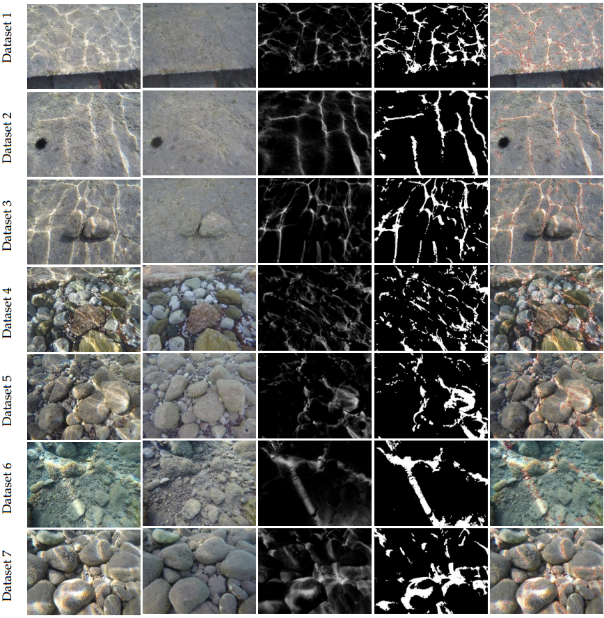
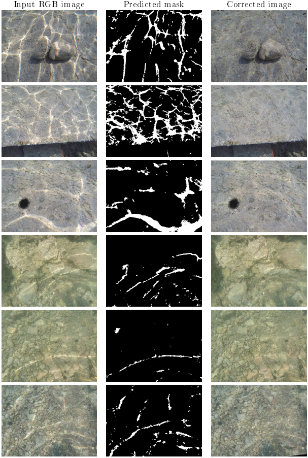

# Seafloor-type-Invariant-Removal-of-Caustics-from-Underwater-Imagery

Code for the paper: 
```text
"P. Agrafiotis, K. Karantzalos and A. Georgopoulos, "Seafloor-Invariant Caustics Removal From Underwater Imagery," in IEEE Journal of Oceanic Engineering, doi: 10.1109/JOE.2023.3277168."
```
[[Paper in IEEE in Open Access](https://ieeexplore.ieee.org/document/10172291)]

**You can find the dataset used here: (https://doi.org/10.5281/zenodo.6467283)



**Resulted corrected images:**




## BibTeX

If you use this code in your research, please cite our paper:

```bibtex
@xxx{xxx,
   ,
}
